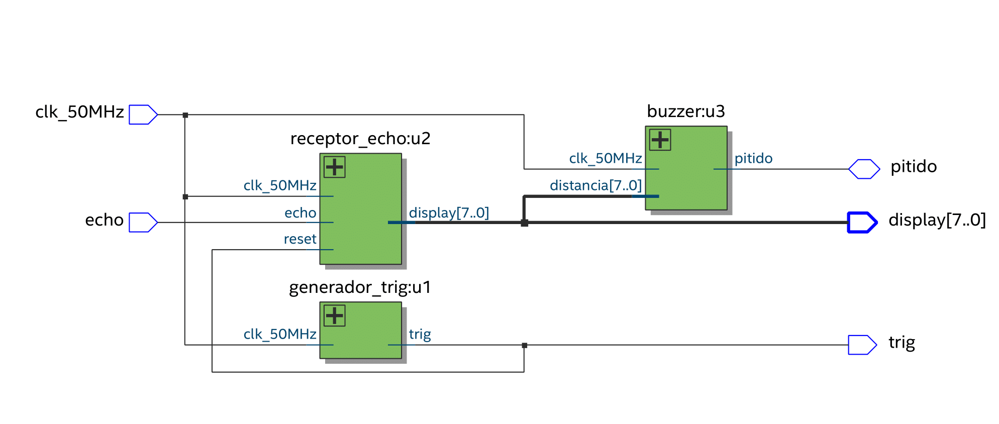

# Diseño lógico para el sensor ultrasónico HC-SR04 en una FPGA
Para poder manipular el sensor HC-SR04, se tiene que conocer el funcionamiento de este. Quien te proporciona esto es la empresa que fabrica dicho sensor (ver [aquí](https://cdn.sparkfun.com/datasheets/Sensors/Proximity/HCSR04.pdf)). El diagrama de tiempos muestra las señales tanto para le pin de entrada (Trig) y de salida (Echo). Así como también la señal interna que se genera para el zumbador (la señal cuadrada de 8 pulsos a 40 KHz).

   
  Diagram de tiempos del sensor HC-SR04

Para este proyecto, se hizo el diseño con un enfoque estructual como se muestra el la siguiente Figura. 

    
  Diagrama esquemático para el controlador HC-SR04

Este consta simplemente de tres bloques que tienen las siguientes funcionalidades:

1. El bloque *generador_trig:u1*, como su nombre lo sugiere, se encarga de generar una señal periódica con un pulso de duración de $10 \micro s$ en nivel alto. Es periodo de este pulso es $60 ms$. Para este bloque se usó contadores (escalamiento) que dividen la frecuencia del reloj original (por ejemplo, 50 MHz en muchas FPGAs) para obtener un periodo de 60 ms. Esto permite sincronizar el pulso de $10 \mu s$ en nivel alto con el periodo deseado de $60 ms$.
2. Una vez enviado este pulso, el sensor generará una señal una señal cuadrada de 8 pulsos internamente. Esto con el objetivo de excitar al zumbador emisor para que emita una señal analógica (sonido) a $40 KHz$. La señal que regresa del objeto, ingresa por el el zumbador receptor. Aquí es donde toma lugar el bloque *receptor_echo:u2* que recibe dicha señal ya de forma digital (se convierte de analógico a digital internamente). Este bloque estima la duración en nivel alto de la señal de entrada para así estimar la distancia medida y mostrarlo por los displays de 7 segmentos.
3. Finalmente, el bloque *buzzer:u3*, emite un pitido cuando el sensor se encuentra a una distancia de 9 centímetros de un objeto.
